# Capstone: Efectividad de campañas de marketing y comportamiento de compra de clientes

Proyecto final de análisis de datos con PostgreSQL. Simula el trabajo de un/a analista
de datos que evalúa, para el área de Marketing de una empresa de retail, si sus campañas
están funcionando y en qué categorías/canales conviene enfocar los recursos.

## Problema de negocio

El equipo de Marketing viene corriendo 6 campañas distintas sobre la misma base de
2.236 clientes, sin tener claro:

1. Qué categorías de producto realmente sostienen la facturación.
2. Si alguna campaña funcionó mejor que las demás.
3. Si las campañas están generando más gasto, o si solo están llegando a los clientes
   que ya eran valiosos.
4. Quiénes son los clientes de mayor valor, para acciones de fidelización puntuales.
5. Qué canal de compra conviene reforzar según el nivel de ingreso del cliente.

## Dataset

**"Customer Personality Analysis"** (Kaggle, [imakash3011](https://www.kaggle.com/datasets/imakash3011/customer-personality-analysis)).
2.240 clientes reales, con demografía, gasto por categoría de producto, compras por
canal y respuesta a 6 campañas de marketing.

El archivo original viene como **una sola tabla ancha de 29 columnas por cliente**. Se
decidió normalizarlo en 4 tablas relacionadas en vez de dejarlo como tabla única, para
poder aplicar `GROUP BY` por categoría/canal/campaña sin repetir lógica por cada una de
las 15 columnas que se repetían en el archivo original.

| Tabla | Contenido |
|---|---|
| `clientes` | Demografía y comportamiento general (1 fila por cliente) |
| `gasto_por_categoria` | Gasto de cada cliente en cada una de 6 categorías (normalizado desde `Mnt*`) |
| `compras_por_canal` | Cantidad de compras de cada cliente por canal (normalizado desde `Num*Purchases`) |
| `respuesta_campanas` | Si cada cliente aceptó o no cada una de las 6 campañas (normalizado desde `AcceptedCmp1-5` + `Response`) |

Se descartaron del modelo las columnas `Z_CostContact` y `Z_Revenue` del dataset
original: tienen el mismo valor en las 2.240 filas, por lo que no aportan ninguna
capacidad analítica.

### Diagrama entidad-relación

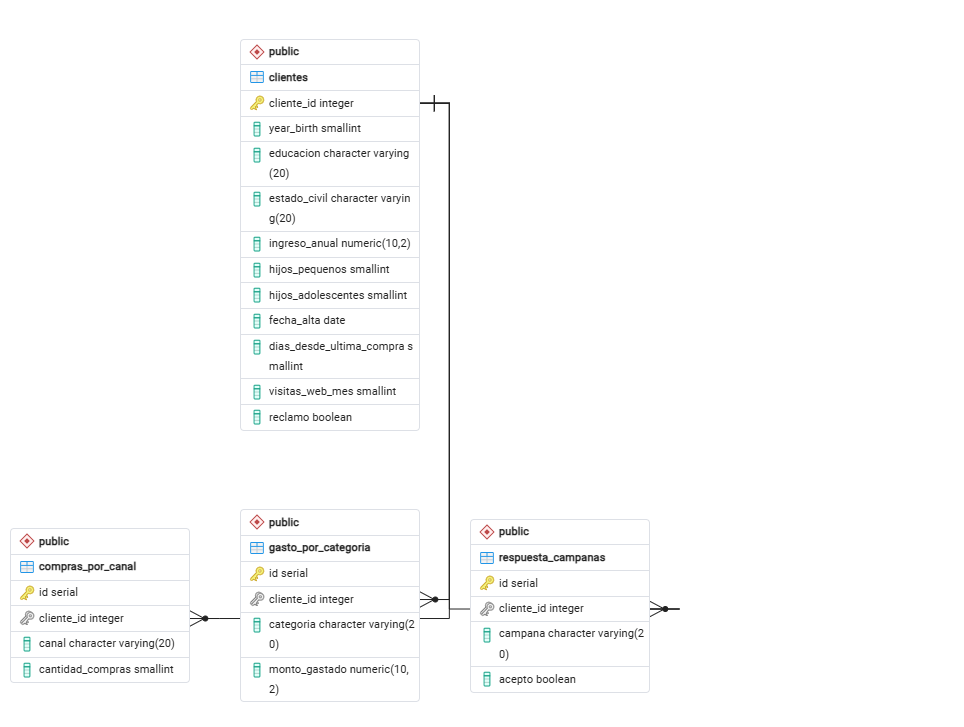

*(Generado con la herramienta ERD Tool de pgAdmin 4 sobre este esquema — ver pasos de
generación en la sección de ejecución.)*

## Archivos del repositorio

| Archivo | Contenido |
|---|---|
| `estructura.sql` | Creación de las 4 tablas, restricciones (`PK`, `FK`, `CHECK`) e índices. |
| `analisis.sql` | Verificación de la limpieza aplicada en la carga + 5 consultas de negocio comentadas. |
| `README.md` | Este archivo. |

Los datos se cargan por separado, importando 4 archivos CSV ya limpios
(`clientes.csv`, `gasto_por_categoria.csv`, `compras_por_canal.csv`,
`respuesta_campanas.csv`) con la herramienta **Import/Export Data** de pgAdmin 4.

## Limpieza de datos

El dataset original tiene problemas de calidad reales, no simulados. Se identificaron y
resolvieron **antes** de cargar los datos a PostgreSQL:

- **24 nulos en `Income`**: se completaron con la **mediana** (no el promedio), porque
  el ingreso tiene una distribución asimétrica y un outlier extremo que hubiera
  distorsionado cualquier promedio.
- **1 registro con `Income` = 666.666**: un valor imposible frente al resto de la
  muestra (percentiles 25–75 entre 35.000 y 68.500). Se excluyó por ser un error de
  carga evidente, no un cliente real de altos ingresos.
- **3 registros con año de nacimiento anterior a 1940** (1893, 1899, 1900): implicarían
  clientes de más de 125 años. Se excluyeron por el mismo motivo.
- **Categorías inconsistentes en `Marital_Status`** (`Absurd`, `YOLO`, `Alone`, 7 casos
  en total): se unificaron bajo la categoría `Otro`, en vez de tratarlas como estados
  civiles válidos o descartar esos registros completos (la persona y su gasto siguen
  siendo datos válidos, solo el rótulo de estado civil no lo era).
- **`Dt_Customer`** venía como texto en formato `DD-MM-YYYY`: se convirtió a `DATE` real.

`analisis.sql` (sección 1) **verifica con SQL** que estas reglas se hayan aplicado
correctamente antes de correr cualquier consulta de negocio (0 nulos, rangos de fecha e
ingreso razonables, categorías válidas, y que la normalización en las 3 tablas de
detalle sea consistente para los 2.236 clientes).

### Evidencia de la carga y la limpieza

**Control de carga** (estructura.sql): confirma las 2.236 filas de `clientes` y las
13.416 / 8.944 / 13.416 filas de las tablas normalizadas.

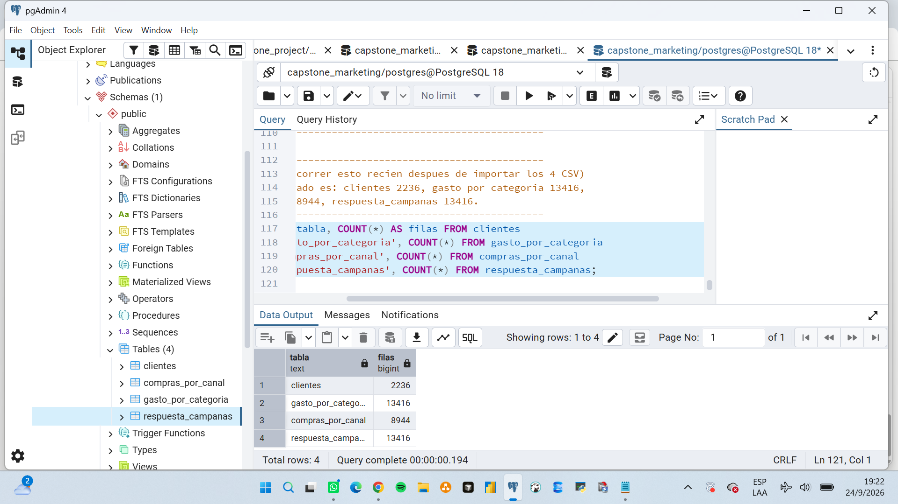

**1.1 — Nulos en columnas críticas**: 0 en las 3 columnas verificadas.

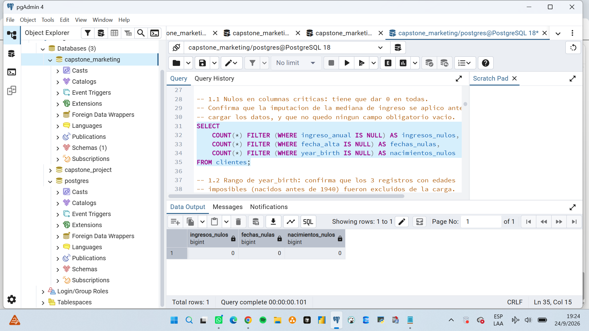

**1.2 — Rango de año de nacimiento**: entre 1940 y 1996, sin los 3 registros imposibles.

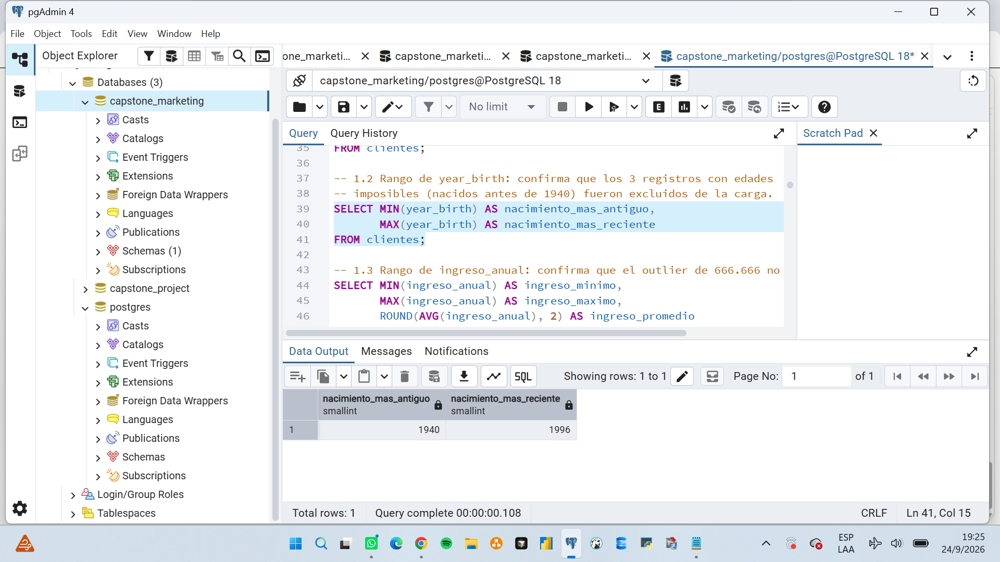

**1.3 — Rango de ingreso anual**: máximo 162.397, sin el outlier de 666.666.

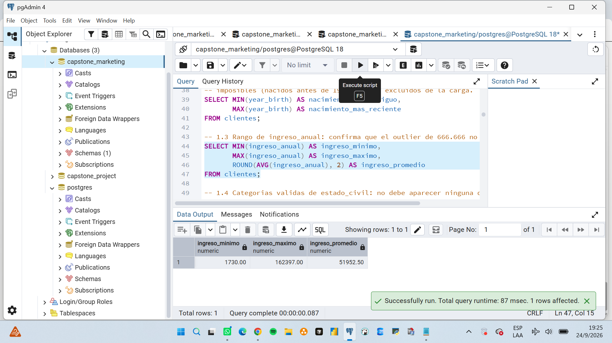

**1.4 — Categorías válidas de estado civil**: solo las 6 categorías esperadas,
incluyendo `Otro` con los 7 casos unificados.

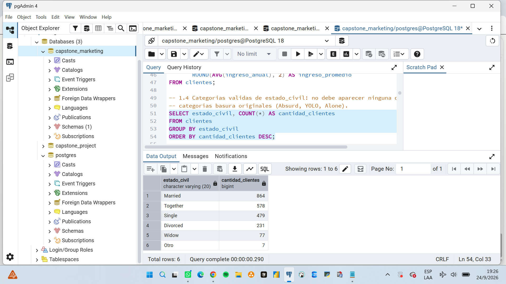

**1.5 — Verificación de tipos de datos**: `date` y `numeric`, no texto.

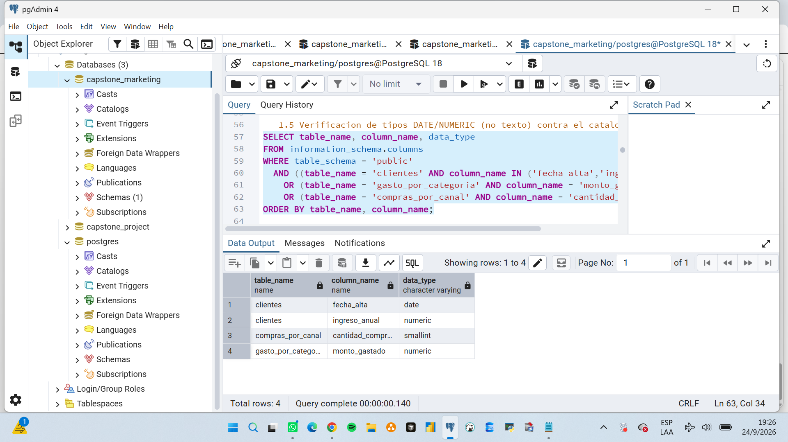

**1.6 — Integridad de la normalización**: 0 filas devueltas (ningún cliente quedó mal
cargado en las tablas de detalle).

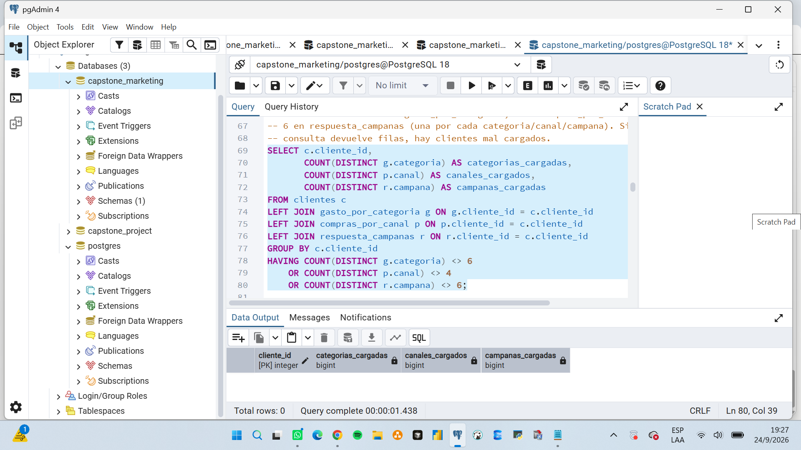

## Hallazgos principales

### 1. Vinos es, por lejos, la categoría más importante

| Categoría | Ingreso total | Gasto promedio/cliente |
|---|---:|---:|
| Vinos | 680.029 | 304,13 |
| Carnes | 373.375 | 166,98 |
| Oro | 98.346 | 43,98 |
| Pescado | 83.931 | 37,54 |
| Dulces | 60.552 | 27,08 |
| Frutas | 58.753 | 26,28 |

Vinos genera casi el doble que Carnes, y casi 12 veces lo que genera Frutas. **La
facturación de la empresa depende fuertemente de una sola categoría** — una caída en
Vinos golpearía el negocio mucho más que una caída en cualquier otra categoría.

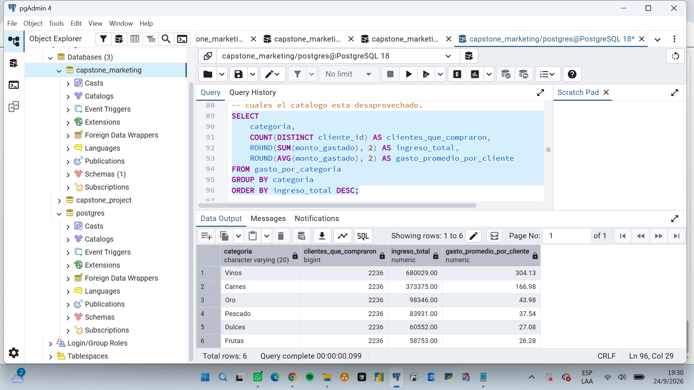

### 2. La última campaña fue, de lejos, la más efectiva — y la Campaña 2 fue un fracaso

| Campaña | Tasa de aceptación |
|---|---:|
| Última campaña (Response) | 14,94% |
| Campaña 4 | 7,47% |
| Campaña 3 | 7,29% |
| Campaña 5 | 7,25% |
| Campaña 1 | 6,44% |
| Campaña 2 | 1,34% |

La última campaña más que duplicó la tasa de cualquiera de las anteriores. Vale la pena
revisar qué se hizo distinto ahí (oferta, canal de contacto, segmentación) para
repetirlo. La Campaña 2, en cambio, prácticamente no tuvo efecto — no parece razonable
seguir invirtiendo en ese formato sin rediseñarlo primero.

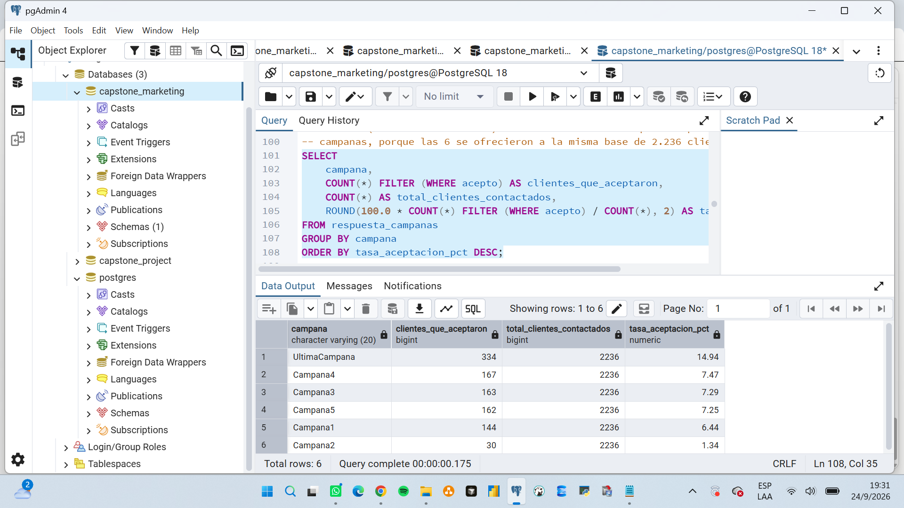

### 3. Quien acepta campañas gasta el doble — pero probablemente no es por la campaña

| Segmento | Clientes | Gasto promedio |
|---|---:|---:|
| Aceptó al menos una campaña | 608 | 999,93 |
| Nunca aceptó ninguna | 1.628 | 458,86 |

A primera vista esto parece un éxito de marketing, pero **es un error interpretarlo como
que las campañas generan ese mayor gasto**. Lo más probable es la relación inversa: los
clientes que ya gastaban más (más comprometidos con la marca) son los que prestan
atención a las campañas y las aceptan — no que la campaña los haya convertido en
grandes compradores. Confirmarlo requeriría comparar el gasto de cada cliente *antes* y
*después* de cada campaña, dato que este dataset no tiene. Tratar esta correlación como
causalidad llevaría a sobreestimar el retorno real de las campañas.

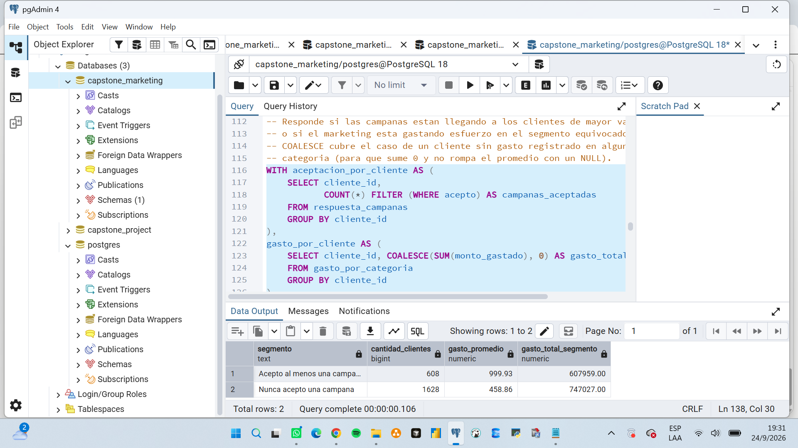

### 4. Los clientes top no son necesariamente los de mayor ingreso declarado

| Puesto | Cliente | Educación | Estado civil | Ingreso | Gasto total |
|---:|---:|---|---|---:|---:|
| 1 | 5350 | Master | Single | 90.638 | 2.525 |
| 1 | 5735 | Master | Single | 90.638 | 2.525 |
| 3 | 1763 | Graduation | Together | 87.679 | 2.524 |
| 4 | 4580 | Graduation | Married | 75.759 | 2.486 |
| 5 | 4475 | PhD | Married | 69.098 | 2.440 |

Los 5 clientes de mayor gasto tienen ingresos altos (69.000–90.600), pero **no son los
de mayor ingreso de toda la base** (el ingreso máximo en el dataset es 162.397) — son
clientes de ingreso alto-medio que gastan de forma consistente, más que unos pocos
clientes de altísimo ingreso que gastan poco. Esto sugiere que la fidelización debería
apuntar a ese perfil (ingreso alto pero no extremo, con gasto sostenido), en vez de
asumir que "más ingreso = más valioso".

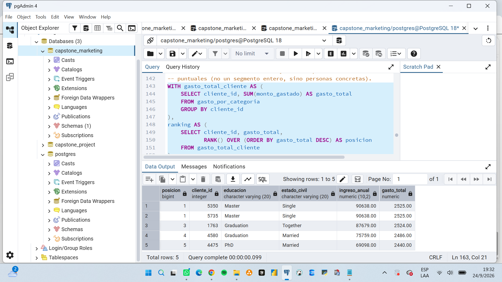

### 5. Catálogo es el canal más débil en los 3 segmentos de ingreso — pero con potencial

| Segmento de ingreso | Tienda | Web | Catálogo | Con descuento |
|---|---:|---:|---:|---:|
| Ingreso alto | 4.728 | 3.023 | 3.243 | 807 |
| Ingreso medio | 6.608 | 5.019 | 2.453 | 3.270 |
| Ingreso bajo | 1.623 | 1.098 | 259 | 259* |

*(Con descuento: 1.124 en ingreso bajo)*

Catálogo queda último en ingreso bajo y medio, aunque en ingreso alto supera incluso a
Web. Interpretación: **Catálogo no es un canal fallido, es un canal desaprovechado**
fuera del segmento de ingreso alto — muy probablemente porque el catálogo físico tiene
un costo de producción/envío que no se está aprovechando en la base completa. En vez de
discontinuarlo, tiene sentido invertir en relanzarlo dirigido específicamente al
segmento de ingreso medio y alto (donde ya muestra tracción), en lugar de mandarlo a
toda la base por igual.

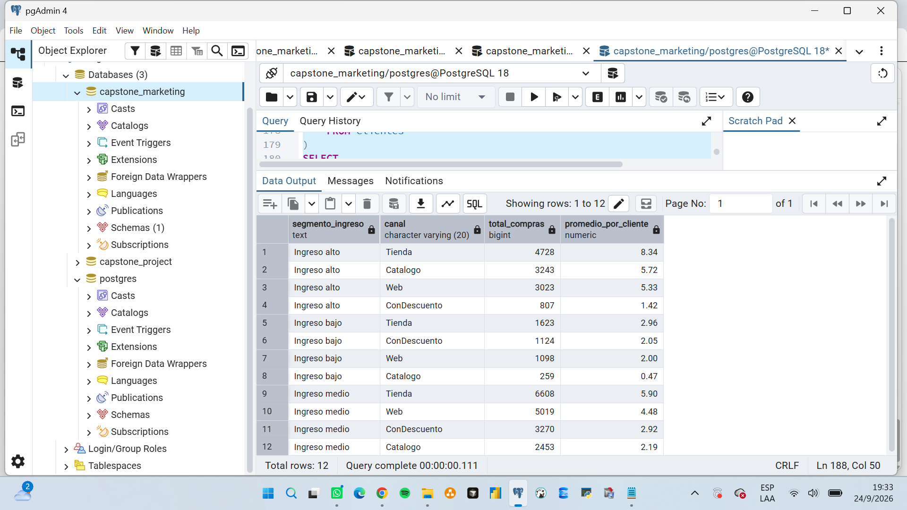

## Cómo ejecutar el proyecto

### Requisitos
- PostgreSQL 12+ con pgAdmin 4.
- Los 5 archivos de este repositorio, más los 4 CSV de datos ya limpios.

### Pasos
1. Crear la base `capstone_marketing` desde pgAdmin (**Create → Database**).
2. Abrir un Query Tool conectado a `capstone_marketing`, pegar y ejecutar
   `estructura.sql` completo (crea las 4 tablas, sin datos).
3. Importar los 4 CSV, **en este orden** (clientes primero, por las foreign keys):
   `clientes.csv` → `gasto_por_categoria.csv` → `compras_por_canal.csv` →
   `respuesta_campanas.csv`, usando click derecho sobre cada tabla →
   **Import/Export Data**. En `gasto_por_categoria`, `compras_por_canal` y
   `respuesta_campanas`, destildar la columna `id` en la pestaña **Columns** del
   asistente (es autogenerada).
4. Correr el bloque de **CONTROL DE CARGA** al final de `estructura.sql` y confirmar:
   `clientes` 2236, `gasto_por_categoria` 13416, `compras_por_canal` 8944,
   `respuesta_campanas` 13416.
5. Ejecutar `analisis.sql` por bloques: primero la sección 1 (verificación de limpieza),
   después cada una de las 5 preguntas de negocio.

## Limitaciones

- El dataset no tiene fecha de compra individual por transacción (solo un agregado de
  compras por canal), por lo que no se pudo analizar estacionalidad como en otros
  proyectos con datos de ventas transaccionales.
- La relación entre aceptación de campañas y gasto es correlacional, no causal (ver
  hallazgo 3); no se dispone de datos de gasto pre/post campaña para confirmarlo.
- Los cortes de "ingreso bajo/medio/alto" se definieron con los percentiles 25 y 75 del
  propio dataset, una decisión razonable pero no la única posible.
